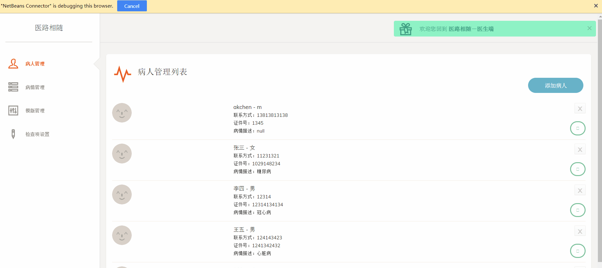
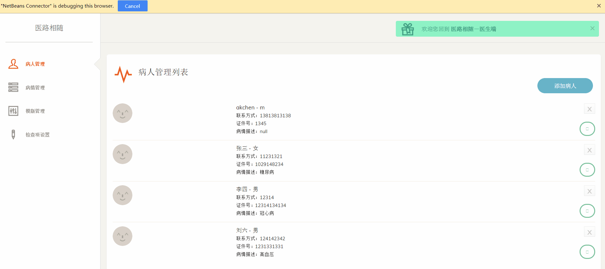
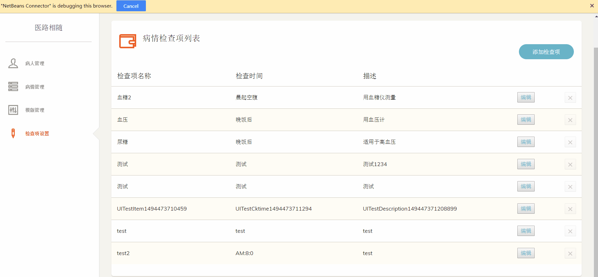
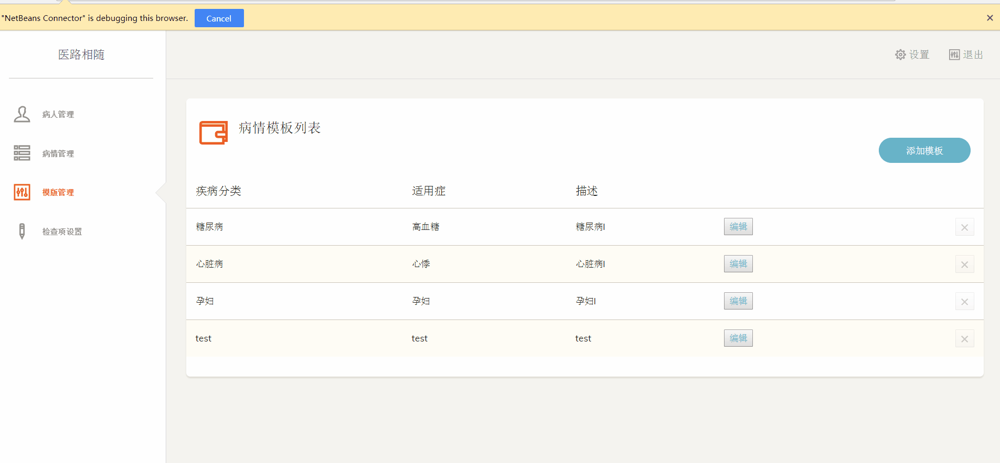
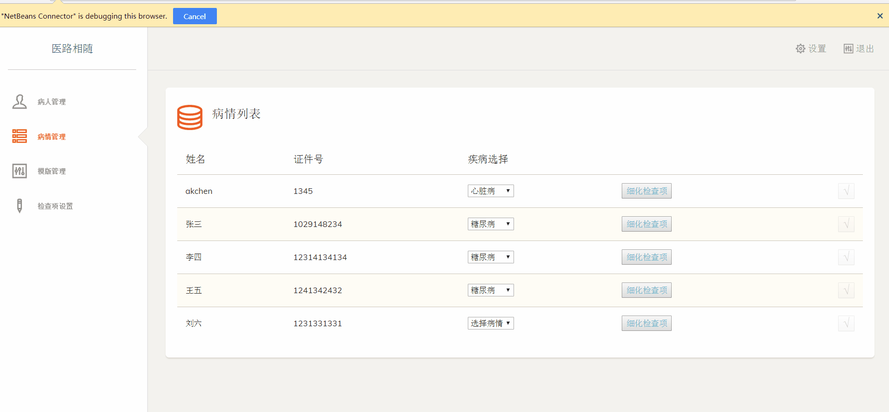
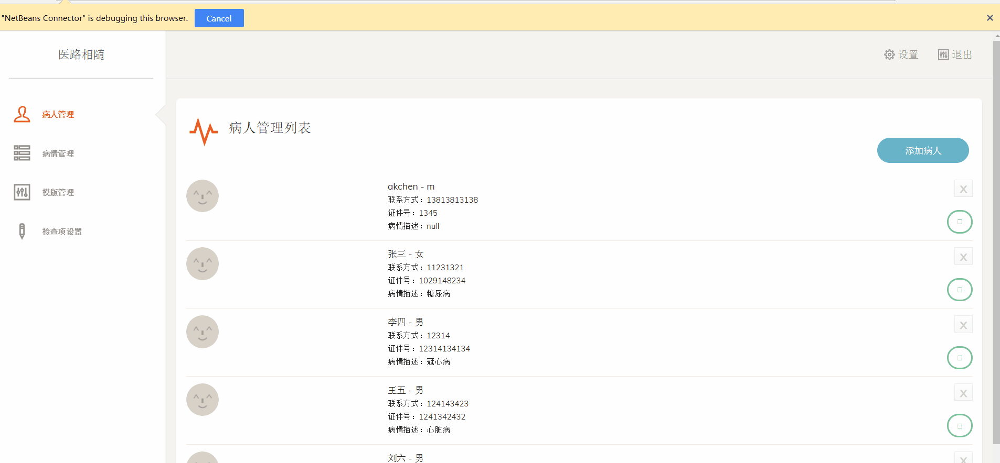

# Dr.WithYouWebServer

Dr.WithYou(Web) is an application designed for community doctors. Now in China, community doctors and their regular follow-ups are predominant phenomenon. For patients with chronic diseases, what they need is long-term monitering rather than irrgular visits to doctors.

We hope to design such an application helped to master the whole process effectively. Doctors can assign daily checklists to their patients, which should be submitted on time according to prescriptions. Also doctors can see the uploaded checklist data and monitor patients conditions, making sure if a visit is needed or not.

## Functions
- Login
- Manage Patients(search, add, delete, edit profile)
- Manage personal checklist(add, edit, delete)
- Manage personal templet(add, edit, delete)
- Assign checklist to patients
- Send messages
- Check patients uploaded data for each checklist registered(in linechart & data table)

## gif

Functions preview

Patients Management

Checkpoint

Templet

Assign templet to patients

Send messages

## Technical implements
- MVC architecture pattern
- JSP + JDBC + MySQL

